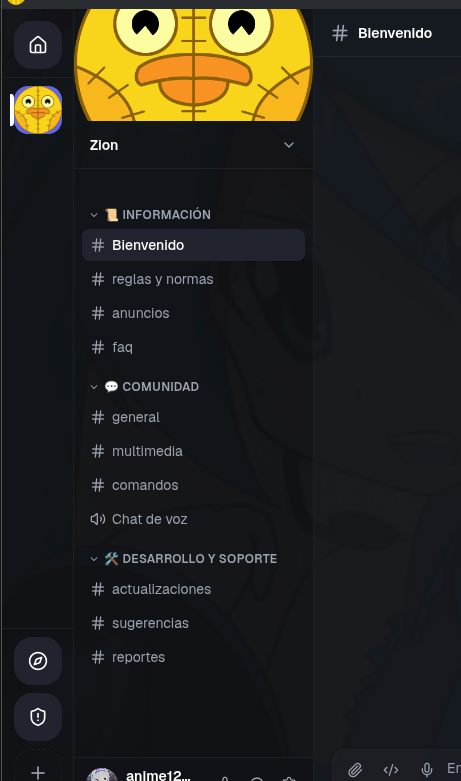
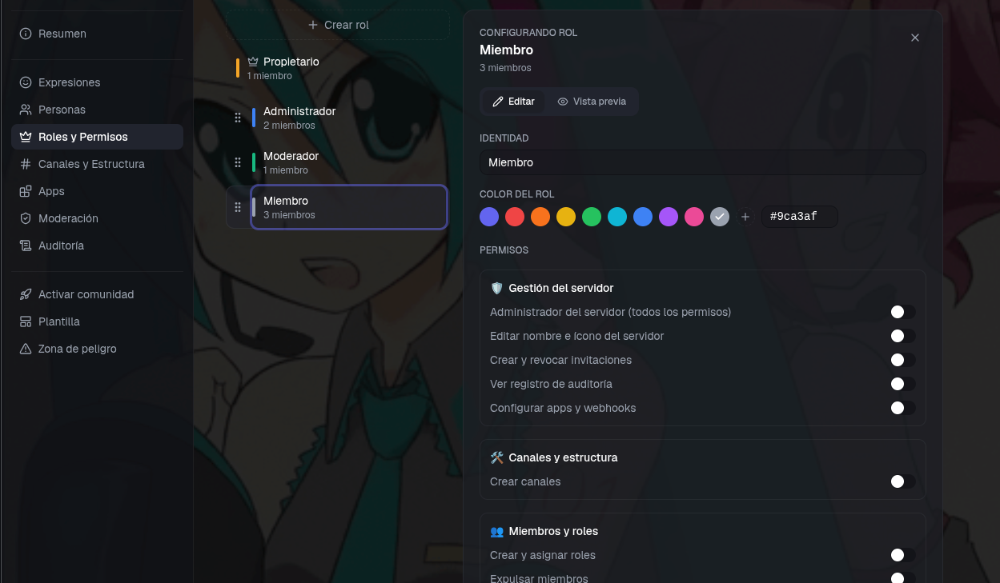
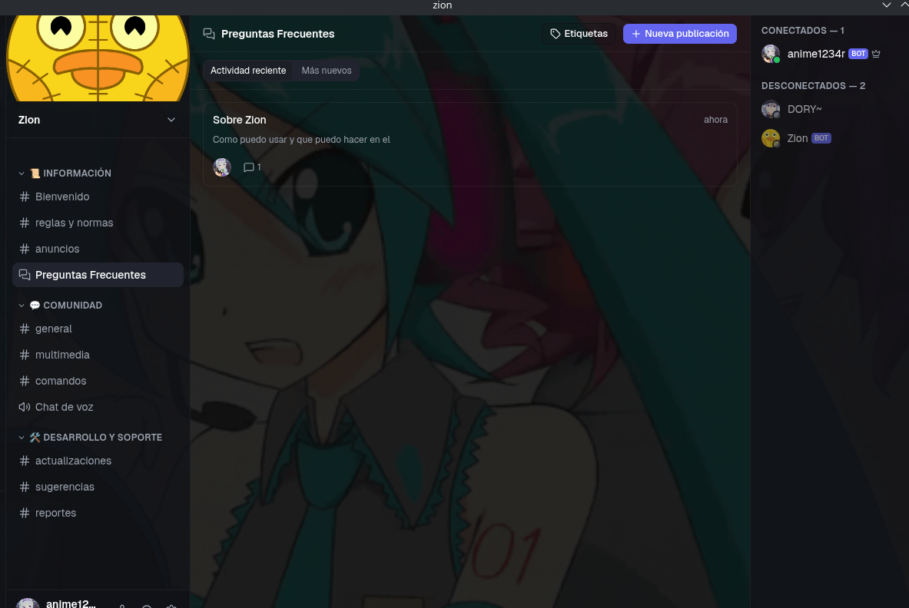
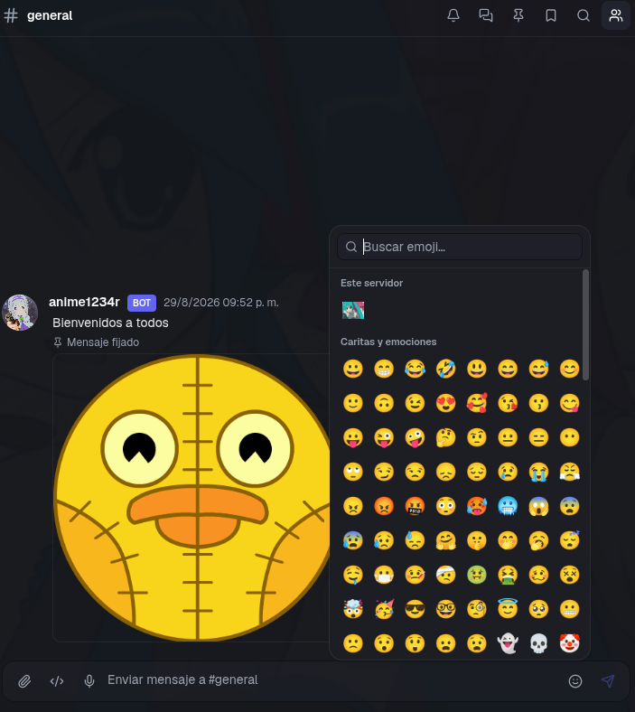
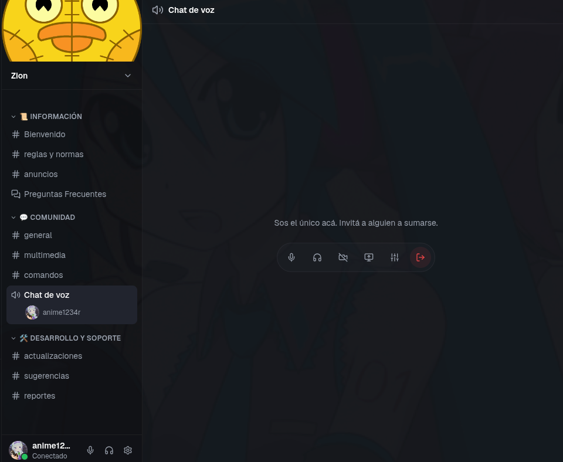
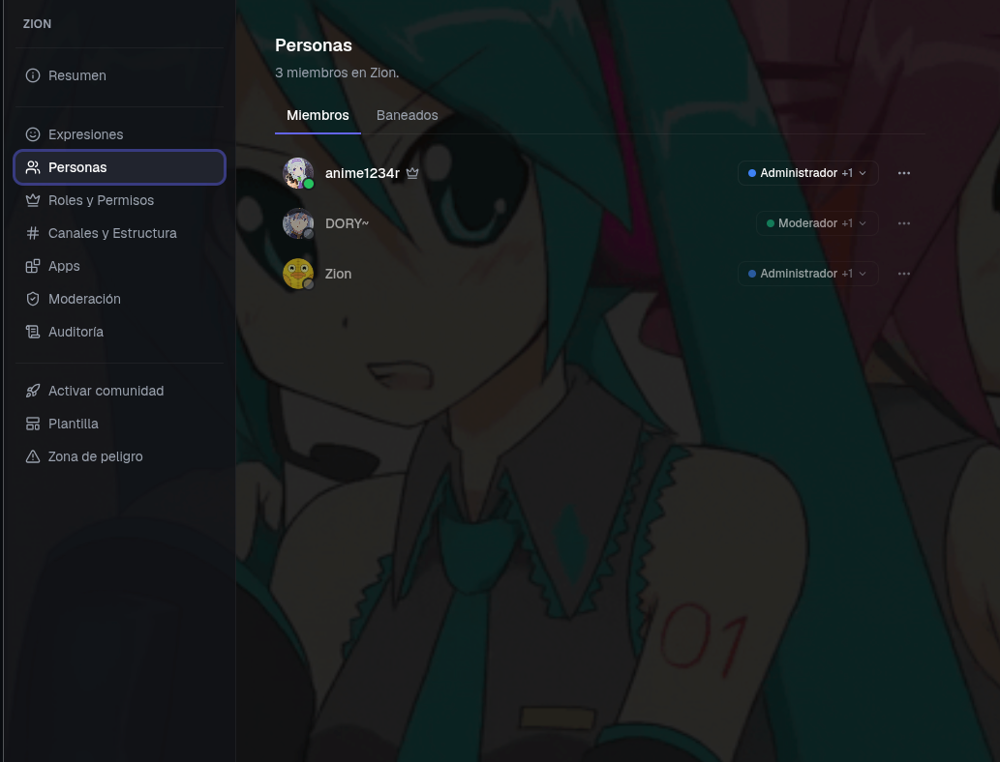
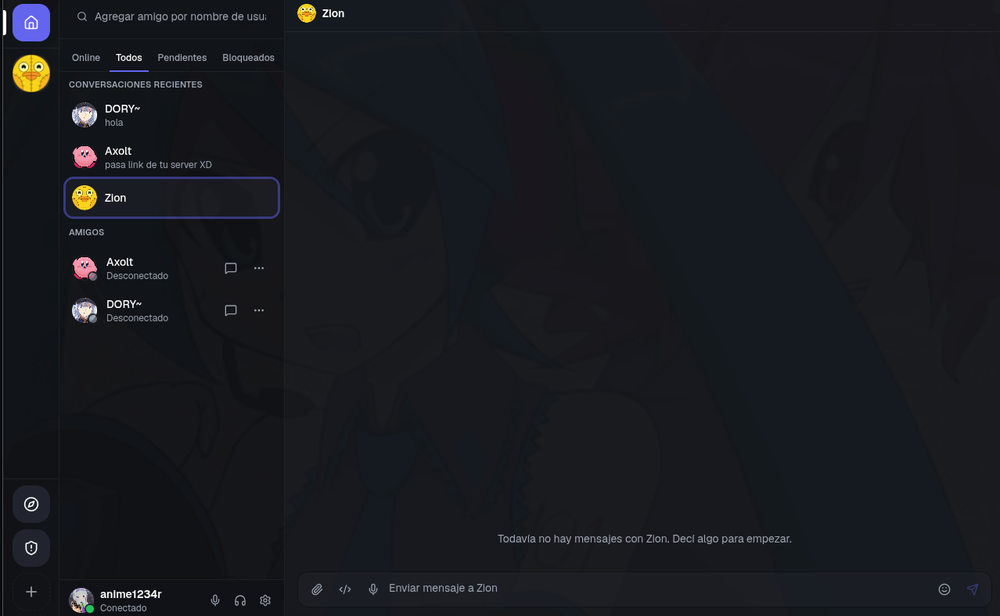
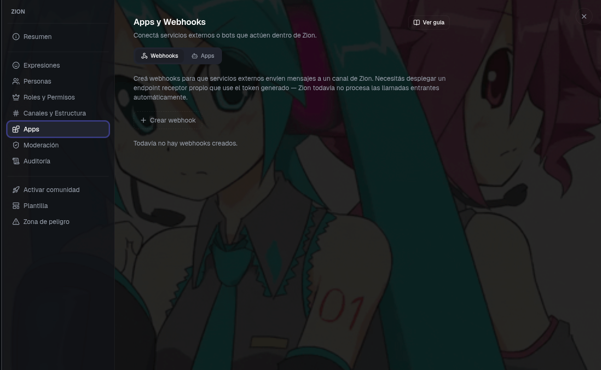

# Zion 🚀

Zion es una app de escritorio para comunidades y chat en tiempo real: servidores, canales, voz, foros, roles con permisos granulares y bots propios, todo en una sola aplicación.

## Funcionalidades

### Servidores y estructura

- Servidores con categorías y canales de texto, voz y foro.
- Reordenamiento de canales y categorías por arrastrar y soltar.
- Plantillas de servidor para replicar una estructura ya armada.
- Creación de canales directamente desde una categoría, heredando su configuración.

### Roles y permisos

- Roles personalizados con color propio.
- Motor de permisos granular: permisos generales por rol con overrides específicos por canal o categoría, con jerarquía y precedencia estrictas.
- Vista previa en vivo ("Ver como rol") que muestra exactamente lo que cada rol puede ver y hacer.

### Canales de foro

- Publicaciones con título y cuerpo, organizadas en hilos.
- Etiquetas para clasificar publicaciones.
- Fijar, bloquear y eliminar hilos según permisos.

### Mensajería

- Formato enriquecido, fragmentos de código, respuestas, reenvío de mensajes, mensajes fijados y búsqueda.
- Reacciones, menciones y autocompletado de emojis.
- Comandos slash dentro del chat.
- Notas de voz y adjuntos de imagen, video o audio.
- Emojis y stickers propios por servidor (Expresiones).

### Voz y video

- Canales de voz con cámara, compartir pantalla, silenciar/ensordecer y ajustes de audio.

### Miembros y moderación

- Gestión de miembros, apodos, expulsiones y baneos.
- Niveles de moderación configurables por servidor.
- Registro de auditoría de las acciones realizadas en el servidor.
- Zona de peligro: transferir titularidad o eliminar el servidor.

### Mensajes directos y social

- Conversaciones directas y panel de amigos.
- Notificaciones dentro de la app.
- Perfiles personalizables: avatar, banner, biografía, color y fondo animado.
- Estados de presencia (en línea, ausente, ocupado, desconectado).

### Apps y Webhooks

- Webhooks atados a un canal fijo para integraciones simples.
- Apps con token propio atado a un rol: cada app crea un bot con identidad real (miembro del servidor, con insignia "BOT", nombre y avatar personalizables), limitado exactamente a los permisos de su rol.
- Guía integrada en Zion con ejemplos listos para implementar bots y servicios externos.

### Actualizaciones
- Actualización automática en segundo plano, con aviso dentro de Zion cuando hay una versión nueva lista para instalar.

## Cómo funciona

Zion combina dos capas:

- **En la nube**: el contenido de las comunidades (mensajes, servidores, roles, canales, archivos) se sincroniza en tiempo real entre todos tus dispositivos apenas se envía o se modifica, sin que tengas que actualizar nada manualmente.
- **En local**: Zion corre como un ejecutable instalado en tu escritorio, con integración nativa al sistema operativo (notificaciones, portapapeles, enlaces de invitación directos, actualizaciones automáticas en segundo plano). La personalización local solo está disponible a través de los archivos y herramientas oficiales que provee el desarrollador — nunca modificando el código o los binarios por cuenta propia.

> **Plataformas**: Zion se distribuye para Windows y Linux. Mac todavía no está soportado.
